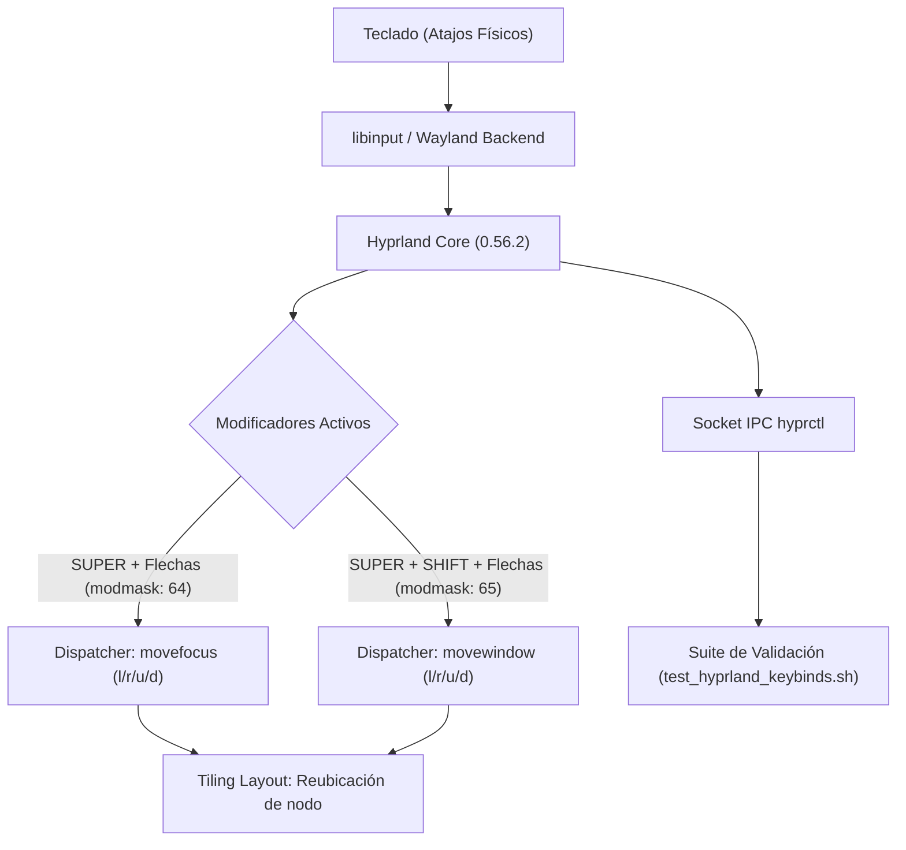

# Hyprland Compositor Configuration

Configuración modular del compositor Wayland [Hyprland](https://hyprland.org) administrada en el repositorio de dotfiles.

## Arquitectura del Sistema de Entrada y Ventanas



## Arquitectura y Módulos

- **Archivo Principal**: [`hyprland.conf`](file:///home/paul/dotfiles/.config/hypr/hyprland.conf)
- **Navegación y Movimiento de Ventanas**:
  - `SUPER + left/right/up/down`: `movefocus, l/r/u/d` (desplazamiento de foco sin alterar la disposición del mosaico).
  - `SUPER SHIFT + left/right/up/down`: `movewindow, l/r/u/d` (desplazamiento físico y reordenamiento de la ventana activa en el mosaico).
- **Decoración de Ventanas**: Directiva `decoration { rounding = 10 }` para proveer un radio de 10 píxeles en bordes redondeados.
- **Entorno Gráfico**: Monitor `eDP-1` a 1920x1080@144Hz.
- **Terminal por Defecto**: `ghostty`.
- **Integraciones Shell**: QuickShell (Cocoa), SwayNC, Hyprpaper.

## Atajos Direccionales

| Combinación de Teclas | Acción | Dispatcher | Dirección |
| :--- | :--- | :--- | :--- |
| `Super + Shift + Left` | Mover ventana hacia la izquierda | `movewindow` | `l` |
| `Super + Shift + Right` | Mover ventana hacia la derecha | `movewindow` | `r` |
| `Super + Shift + Up` | Mover ventana hacia arriba | `movewindow` | `u` |
| `Super + Shift + Down` | Mover ventana hacia abajo | `movewindow` | `d` |
| `Super + Left` | Cambiar foco a la ventana izquierda | `movefocus` | `l` |
| `Super + Right` | Cambiar foco a la ventana derecha | `movefocus` | `r` |
| `Super + Up` | Cambiar foco a la ventana superior | `movefocus` | `u` |
| `Super + Down` | Cambiar foco a la ventana inferior | `movefocus` | `d` |

## Dependencias

- **Hyprland**: Compositor de ventanas dinámico en mosaico Wayland (`/usr/bin/hyprland` v0.56.2).
- **hyprctl**: Herramienta CLI de control e IPC para Hyprland (`/usr/bin/hyprctl`).
- **Python 3**: Motor de aserción y validación JSON/RegEx para pruebas.
- **grim / slurp / wl-copy**: Herramientas de captura de pantalla y portapapeles.

## Validación y Pruebas Automatizadas

1. **Atajos de movimiento y navegación**:
   ```bash
   ~/dotfiles/.config/hypr/tests/test_hyprland_keybinds.sh
   ```

2. **Bordes redondeados**:
   ```bash
   ~/dotfiles/.config/hypr/tests/test_hyprland_rounding.sh
   ```

## Recarga en Vivo del Compositor

```bash
hyprctl reload
```
